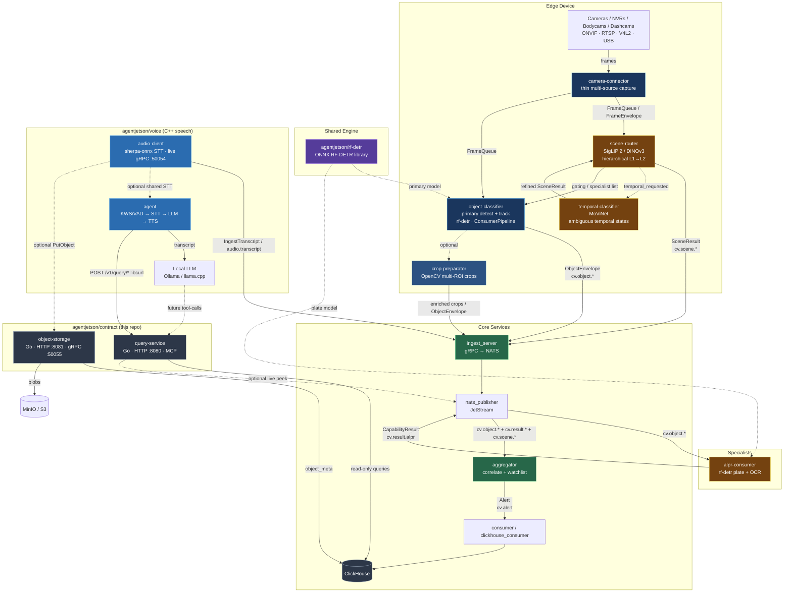

# AgentJetson Architecture



## Subject hierarchy (JetStream stream `CV_EVENTS`)

| Subject pattern       | Producer          | Consumer(s)              | Payload              |
|-----------------------|-------------------|--------------------------|----------------------|
| `cv.object.<class>`   | recorder (object-classifier) | alpr_consumer, aggregator | `ObjectEnvelope`     |
| `cv.result.<capability>` | specialists (alpr, …) | aggregator            | `CapabilityResult`   |
| `cv.alert`            | aggregator        | consumer, clickhouse, …  | `Alert`              |

Legacy stream `CV_ALERTS` still captures `cv.alert` for existing consumers.

## Flow

```
Cameras → recorder (slim Pipeline)
            │ detect + track + crop JPEG
            ▼
        IngestObject (gRPC)
            ▼
        NATS  cv.object.car / cv.object.person / …
            │
            ├──────────────────► alpr_consumer
            │                      │ plate OCR on crop
            │                      ▼
            │                   cv.result.alpr
            │                      │
            └──────────────────► aggregator
                                   │ correlate by (frame_id, track_id)
                                   │ apply watchlist / policy
                                   ▼
                                cv.alert
                                   │
                                   ├─► consumer (demo)
                                   └─► clickhouse_consumer
```

## Components

### Recorder (camera-connector + object-classifier (ConsumerPipeline))
- Capture lives in `camera-connector`; detect+track lives in `object-classifier`.
- Capture, primary detection, tracking only.
- Emits one `ObjectEnvelope` per tracked object of interest (with optional JPEG crop).
- **No** plate OCR, **no** watchlist.

### ALPR consumer ([alpr-consumer](https://github.com/agentjetson/alpr-consumer)) — specialist template
- Pulls `cv.object.*`, filters to vehicle classes.
- Runs plate ROI + OCR (mock today; drop in real LPRNet later).
- Publishes `CapabilityResult` on `cv.result.alpr`.

### Aggregator (`src/aggregator`)
- Correlates objects + capability results in a short time window.
- Applies watchlist (class + plate text).
- Emits final `Alert` on `cv.alert`.

## Adding a new specialist (e.g. vehicle colour)

1. Copy `src/alpr_consumer` → `src/vehicle_attr_consumer`.
2. Change filter / capability string / inference.
3. Publish to `cv.result.vehicle_attr`.
4. Extend aggregator to merge the new attributes into the Alert (or keep them as side-channel results).

## Incremental path status

1. ✅ Extract plate logic into dedicated ALPR consumer
2. ✅ Recorder publishes object envelopes (class + bbox + crop)
3. ✅ Subject hierarchy `cv.object.>`, `cv.result.>`, `cv.alert`
5. ✅ Watchlist / alert assembly moved to aggregator
