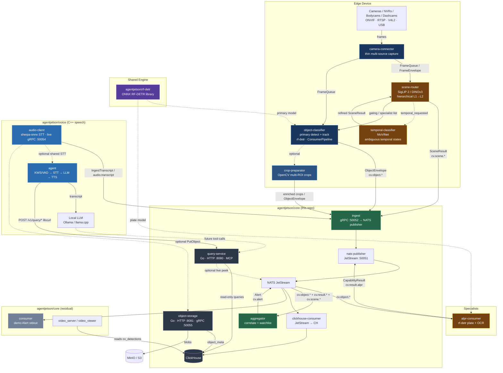

# AgentJetson Architecture



## Subject hierarchy (JetStream)

Canonical map: [`domain/nats-subjects.yaml`](domain/nats-subjects.yaml).

| Stream | Subjects | Payload |
|--------|----------|---------|
| `CV_EVENTS` | `cv.object.>`, `cv.result.>`, `cv.scene.>` | ObjectEnvelope / CapabilityResult / SceneResult |
| `CV_ALERTS` | `cv.alert` | Alert |
| `AUDIO_EVENTS` | `audio.transcript` | Transcript |

| Subject pattern | Producer | Consumer(s) | Table |
|-----------------|----------|-------------|-------|
| `cv.object.<class>` | object-classifier / crop-preparator | alpr-consumer, aggregator, clickhouse-consumer | `cv_objects` |
| `cv.result.<capability>` | specialists (alpr, …) | aggregator, clickhouse-consumer | `cv_results` |
| `cv.scene.<level1>` / `cv.scene.result` | scene-router, temporal-classifier | aggregator, clickhouse-consumer | `cv_scenes` |
| `cv.alert` | aggregator | consumer (demo), clickhouse-consumer, video path | `cv_detections` |
| `audio.transcript` | audio-client | clickhouse-consumer | `audio_transcripts` |

## Flow

```
Cameras → object-classifier (or scene-router → object-classifier)
            │ detect + track + crop JPEG  /  SceneResult
            ▼
        IngestObject / IngestScene (gRPC :50052)
            ▼
        nats-publisher → JetStream
            │
            ├──────────────────► alpr-consumer
            │                      │ plate OCR on crop
            │                      ▼
            │                   cv.result.alpr
            │                      │
            └──────────────────► aggregator
                                   │ correlate by (frame_id, track_id)
                                   │ apply watchlist / policy
                                   ▼
                                cv.alert
                                   │
                                   ├─► consumer (demo stdout — core)
                                   └─► clickhouse-consumer → ClickHouse
```

## Components

### Edge (C++)
- **camera-connector** (private) / **camera-connector-onvif** — capture only.
- **scene-router** — hierarchical L1→L2 situation; specialist gating hints.
- **temporal-classifier** — MoViNet refine when `temporal_requested`.
- **object-classifier** — RF-DETR detect + track → `ObjectEnvelope`.
- **crop-preparator** — multi-ROI crops (production NATS path still TODO).
- **alpr-consumer** — pure specialist: `ObjectEnvelope` in → `CapabilityResult` out.

### Contract (this repo — Go)
- **ingest** — gRPC `:50052`; fans out to nats-publisher.
- **nats-publisher** — JetStream publish surface `:50051`.
- **aggregator** — correlates objects + capability results; emits `cv.alert`.
- **clickhouse-consumer** — durable JetStream → ClickHouse writers.
- **query-service** — read-only HTTP `:8080` + MCP; never publishes.
- **object-storage** — blob sink HTTP `:8081` / gRPC `:50055`; metadata to CH.

### Core residual (C++)
- **consumer** — demo Alert stdout consumer.
- **video_server / video_viewer** — annotated video path over ClickHouse `cv_detections`.

### Voice (C++)
- **audio-client** — pure STT recorder + live gRPC + optional ingest.
- **agent** — interactive front-end; calls query-service for scene-aware answers.

## Adding a new specialist (e.g. vehicle colour)

1. Copy `alpr-consumer` pattern → new binary.
2. Filter / capability string / inference.
3. Publish to `cv.result.<capability>`.
4. Extend aggregator to merge attributes into Alert (or keep as side-channel).
5. Ensure clickhouse-consumer maps the capability into `cv_results`.

## Known gaps (see also TODO.md)

- clickhouse-consumer must fully write `cv_objects` / `cv_results` / `cv_scenes` (partial today).
- `pkg/persistence` integration into object-storage + query-service unfinished.
- Taxonomy: `domain/taxonomy.yaml` vs scene-router README prompts — single-source required.
- docker-compose: MinIO vs ClickHouse port 9000 clash; external `core_net` assumption.
