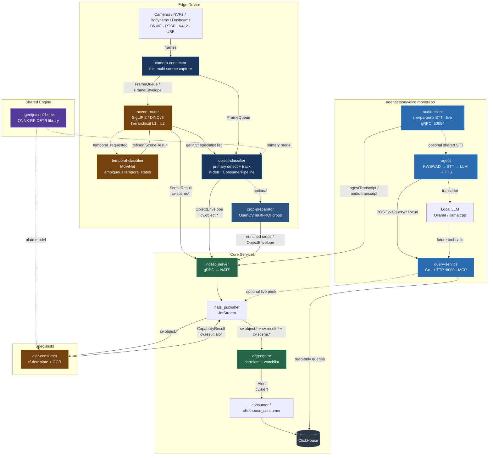

# AgentJetson — System Overview & Run Guide

**Intelligence at the edge of every encounter.**

This document is the single source of truth for how the AgentJetson edge CV + audio pipeline is structured and how to bring the full stack up. Treat it as the breadcrumb trail: follow the dependency order and the architecture will stay coherent as we expand.

**Primary vision backend:** [agentjetson/rf-detr](https://github.com/agentjetson/rf-detr) (RF-DETR via ONNX Runtime — TensorRT → CUDA → CPU).

**Scene routing backends:** SigLIP 2 / DINOv3 (visual) + MoViNet (temporal) — see [scene-router](https://github.com/agentjetson/scene-router) and [temporal-classifier](https://github.com/agentjetson/temporal-classifier).

**This repo owns the contracts.** `.proto` files, ClickHouse DDL, NATS subject map, and scene taxonomy live here. Other repos consume; they do not keep a private copy. The Go query service stays a **separate repo** (`voice-query-service`) — it generates stubs from these protos and reads the `query_*` views. ClickHouse is an interchangeable adapter: `make up` in this repo spins it up with no dependency on core.

See [`CONSUMING.md`](CONSUMING.md), [`seed/README.md`](seed/README.md), [`seed/WRITE_SPEC.md`](seed/WRITE_SPEC.md).

---

## Architecture (current)



### Stable contracts

| Contract           | Direction                               | Subject / RPC                           | Owner                               |
| ------------------ | --------------------------------------- | --------------------------------------- | ----------------------------------- |
| `FrameEnvelope`    | camera-connector → classifier/router    | (future gRPC / NATS)                    | camera-connector                    |
| `SceneResult`      | scene-router / temporal → core          | `cv.scene.<level1>` / `cv.scene.result` | **scene-router**                    |
| `ObjectEnvelope`   | classifier / preparator → core          | `cv.object.<class>` / `IngestObject`    | **stable**                          |
| `CapabilityResult` | specialists → aggregator                | `cv.result.<capability>`                | specialists                         |
| `Alert`            | aggregator → consumers                  | `cv.alert`                              | aggregator                          |
| `Transcript`       | audio-client → core                     | `IngestTranscript` / `audio.transcript` | **voice/audio-client**              |
| **Query APIs**     | query-service → ClickHouse / NATS       | HTTP `/v1/query/*` + MCP tools          | **voice/query-service** (read-only) |

**ObjectEnvelope remains the cornerstone for detection.** Everything upstream of it can evolve (new cameras, new primary models, better crops, **scene gating**). Everything downstream must not care how the envelope was produced.

**SceneResult is the upstream situation contract.** It answers “what kind of situation is this?” and carries Level-1 / Level-2 labels plus a suggested specialist list. RF-DETR and specialists stay pure: they only run when the router gates them on.

**query-service is a pure consumer.** It never publishes back into the CV pipeline. It reads the durable store (ClickHouse) and optionally peeks at live NATS subjects using the same stable contracts.

**audio-client is the pure STT recorder.** Streaming transcription + live gRPC + optional `IngestTranscript`. No LLM, no TTS.

**agent is the interactive front-end.** Hotword/VAD → STT → local LLM (and/or intent heuristics) → TTS. It calls query-service over HTTP for scene-aware answers (e.g. plate lookups).

---

## Repository map

| Repository                                                                    | Role                                                      | Depends on                                              |
| ----------------------------------------------------------------------------- | --------------------------------------------------------- | ------------------------------------------------------- |
| [core](https://github.com/agentjetson/core)                                   | ingest, nats_publisher, aggregator, consumers | ClickHouse adapter is this repo (`make up`)             |
| [rf-detr](https://github.com/agentjetson/rf-detr)                             | Shared C++ RF-DETR ONNX inference library                 | OpenCV, ONNX Runtime                                    |
| [alpr-consumer](https://github.com/agentjetson/alpr-consumer)                 | ALPR specialist (ObjectEnvelope → CapabilityResult)       | core (NATS JetStream), **rf-detr**, Fast-Plate-OCR ONNX |
| [camera-connector](https://github.com/agentjetson/camera-connector)           | Thin multi-source capture (V4L2 / RTSP / file)            | OpenCV                                                  |
| [object-classifier](https://github.com/agentjetson/object-classifier)         | Primary detect + track → ObjectEnvelope                   | camera-connector (frames), core (ingest), **rf-detr**   |
| [crop-preparator](https://github.com/agentjetson/crop-preparator)             | Multi-ROI / padded crops for secondaries                  | object-classifier (ObjectEnvelope), OpenCV              |
| [scene-router](https://github.com/agentjetson/scene-router)                   | Hierarchical scene classification + specialist gating     | camera-connector (frames), ONNX (SigLIP 2 / DINOv3)     |
| [temporal-classifier](https://github.com/agentjetson/temporal-classifier)     | Temporal state refinement (MoViNet) for ambiguous scenes  | scene-router (temporal_requested), ONNX (MoViNet)       |
| **[voice](https://github.com/agentjetson/voice)**                             | **Unified audio path monorepo**                           | core (ingest / ClickHouse / optional NATS), sherpa-onnx, Go 1.22+, Buf |

### Voice monorepo layout (`agentjetson/voice`)

Former standalone repos were merged:

| Directory in `voice/` | Former repo                         | Role |
| --------------------- | ----------------------------------- | ---- |
| `audio-client/`       | agentjetson/audio-client            | Edge STT live client (sherpa-onnx) → gRPC `:50054` + optional ingest |
| `agent/`              | agentjetson/voice-agent             | Interactive agent (KWS/VAD → STT → LLM → TTS); calls query-service |
| `query-service/`      | agentjetson/voice-query-service     | Read-only HTTP `:8080` + MCP over ClickHouse |

Shared at monorepo root:

- `scripts/download_models.sh` — one model tree for both C++ speech binaries
- `models/` — gitignored; Zipformer / Nemotron / Piper / Silero VAD / KWS
- `docker-compose.yml` — query-service (+ optional audio-client profile)
- `docker-compose.core.yml` — overlay to join core NATS / ClickHouse network
- `Makefile`, `.env.example`, root `README.md` (voice breadcrumb)

**Model roles (CV)**

| Role                                   | Repo                              | Model example                               |
| -------------------------------------- | --------------------------------- | ------------------------------------------- |
| Scene embedding / zero-shot router     | scene-router                      | `models/siglip2-base-patch16-224.onnx`      |
| Pure visual embedding (alt)            | scene-router                      | `models/dinov3-vits16.onnx`                 |
| Temporal / action (ambiguous scenes)   | temporal-classifier               | `models/movinet_a0.onnx`                    |
| Primary detect (person, car, truck, …) | object-classifier via **rf-detr** | `models/rf-detr-nano.onnx` (COCO or custom) |
| Plate detect                           | alpr-consumer via **rf-detr**     | `models/rfdetr-plate.onnx`                  |
| Plate OCR                              | alpr-consumer                     | `models/cct_s_v2_global.onnx` + yaml        |

**Model roles (voice — shared under `voice/models/`)**

| Role              | Component              | Pack example |
| ----------------- | ---------------------- | ------------ |
| Streaming STT     | audio-client, agent    | `sherpa-onnx-streaming-zipformer-en-2023-06-26` (default) or Nemotron 0.6B |
| VAD               | agent                  | `silero_vad.onnx` |
| TTS               | agent                  | `vits-piper-en_US-lessac-medium` |
| Hotword (KWS)     | agent (optional)       | `sherpa-onnx-kws-zipformer-gigaspeech-3.3M-2024-01-01` |

---

## Bring-up order (dependencies first)

### 0. Prerequisites (all machines)

- CMake ≥ 3.20, C++17/20 compiler
- OpenCV 4.x / 5.x
- protobuf + gRPC
- **ONNX Runtime** (object-classifier, alpr-consumer, rf-detr, **scene-router**, **temporal-classifier**)
- (voice) **sherpa-onnx** + PortAudio — set `SHERPA_ONNX_ROOT`
- Go 1.22+ + Buf CLI (for `voice/query-service`)
- Docker Compose
- NATS 2.x
- ClickHouse (via core compose)

```bash
export ONNXRUNTIME_ROOT=/path/to/onnxruntime   # or ONNXRUNTIME_ROOT_DIR
export SHERPA_ONNX_ROOT=$HOME/work/libs/sherpa-onnx
export LD_LIBRARY_PATH=$SHERPA_ONNX_ROOT/lib:$LD_LIBRARY_PATH   # Linux
```

### 1. Core services (central / edge cluster)

```bash
git clone https://github.com/agentjetson/core.git
cd core
docker compose up -d nats nats-publisher ingest aggregator consumer

# optional (required for voice query production path):
# clickhouse clickhouse-consumer otel-collector video_server video_viewer

# specialist (same network)
docker compose -f docker-compose.yml -f docker-compose.specialists.yml up -d alpr-consumer
```

Verify:

```bash
curl -s http://localhost:8222/healthz
# ingest gRPC :50052, nats-publisher :50051
```

### 2. alpr-consumer (specialist — same network as core NATS)

```bash
git clone https://github.com/agentjetson/alpr-consumer.git
cd alpr-consumer
# place models: rfdetr-plate.onnx, cct_s_v2_global.onnx, plate config yaml
cmake -B build -DCMAKE_BUILD_TYPE=Release
cmake --build build -j$(nproc)

NATS_URL=nats://localhost:4222 \
ORT_DEVICE=gpu \
PLATE_DETECTOR_MODEL=models/rfdetr-plate.onnx \
PLATE_OCR_MODEL=models/cct_s_v2_global.onnx \
./build/alpr_consumer
```

Creates durable consumer `alpr-worker` on stream `CV_EVENTS` with filter `cv.object.*`. Filters vehicle classes, runs RF-DETR plate ROI + OCR, publishes `cv.result.alpr`.

### 3–7. CV edge path (unchanged)

camera-connector → scene-router → temporal-classifier → object-classifier → crop-preparator — same as before. See individual repo READMEs. Single-box demos prefer `--in-process` capture.

### 8. Voice path (`agentjetson/voice`)

```bash
git clone https://github.com/agentjetson/voice.git
cd voice

# Shared speech models (both C++ binaries)
./scripts/download_models.sh
# optional higher-accuracy STT:
# ./scripts/download_models.sh --nemotron
```

#### 8a. query-service (read-only; DEMO_MODE needs no ClickHouse)

```bash
cd query-service
make generate && make tidy   # if using Buf-generated path

export DEMO_MODE=true
go run ./cmd/server          # :8080

# or from monorepo root:
docker compose up query-service --build
```

Quick test:

```bash
curl -s http://localhost:8080/health | jq
curl -s -X POST http://localhost:8080/v1/query/plates \
  -H 'Content-Type: application/json' \
  -d '{"make_model":"Mercedes","time_window_sec":30,"limit":5}' | jq
```

Production (same env as core compose):

```bash
export DEMO_MODE=false
export CLICKHOUSE_HOST=localhost   # or "clickhouse" inside compose
export CLICKHOUSE_PORT=9000
export CLICKHOUSE_USER=default
export CLICKHOUSE_PASSWORD=pass
export APPLY_SCHEMA=true
go run ./cmd/server
```

MCP / stdio mode:

```bash
./voice-query-service --stdio
# tools: query_recent_plates, query_objects, query_scenes,
#        query_detections, query_transcripts, health
```

#### 8b. audio-client (edge STT recorder)

```bash
cd audio-client
cmake -B build -DCMAKE_BUILD_TYPE=Release \
  -DSHERPA_ONNX_ROOT=$SHERPA_ONNX_ROOT
cmake --build build -j$(nproc) --target audio_client

LIVE_ADDR=0.0.0.0:50054 \
INGEST_ADDR=<ingest-host>:50052 \
SOURCE=mic \
SHERPA_MODEL_TYPE=zipformer \
SHERPA_MODEL_DIR=../models/sherpa-onnx-streaming-zipformer-en-2023-06-26 \
./build/audio_client
```

#### 8c. agent (interactive loop)

```bash
cd agent
cmake -B build -DCMAKE_BUILD_TYPE=Release
cmake --build build -j$(nproc)

ollama pull tinyllama && ollama serve &   # optional LLM

./build/voice_agent \
  --models-dir ../models \
  --query-url http://127.0.0.1:8080
```

Plate / vehicle questions are routed to query-service via libcurl (intent heuristic). Other turns go to Ollama, then rule fallback. Time questions use a small local tool.

---

## ClickHouse schema (this repo)

One schema. Applied by `make schema` (or first `docker compose up` via `seed/sql/`). Core's clickhouse_consumer and query-service **do not CREATE TABLE**.

```bash
make up          # ClickHouse only — 8123 HTTP / 9000 native
make schema      # idempotent DDL
make seed        # demo rows (seed.cam-* / seed.mic-*)
```

Env for consumers (unchanged from core compose):

```
CLICKHOUSE_HOST=localhost
CLICKHOUSE_PORT=9000
CLICKHOUSE_USER=default
CLICKHOUSE_PASSWORD=pass
CLICKHOUSE_DB=default
```

| Subject             | Proto                           | Table                 | Writer today                         |
| ------------------- | ------------------------------- | --------------------- | ------------------------------------ |
| `cv.object.>`       | `detection.v1.ObjectEnvelope`   | `cv_objects`          | **core consumer to add**             |
| `cv.result.>`       | `detection.v1.CapabilityResult` | `cv_results`          | **core consumer to add**             |
| `cv.scene.>`        | `scene.v1.SceneResult`          | `cv_scenes`           | **core consumer to add**             |
| `cv.alert`          | `detection.v1.Alert`            | `cv_detections`       | core clickhouse_consumer             |
| `audio.transcript`  | `audio.v1.Transcript`           | `audio_transcripts`   | core clickhouse_consumer             |

`query_*` views in `seed/sql/003_views.sql` alias proto column names to the Go query-service `Scan` shape (`event_time`, `camera_id`, `plate`, …). `video_server` keeps reading physical `cv_detections` columns (`frame_id, class_id, class_name, confidence, x1, y1, x2, y2`).

Until the extra writers land, query-service can run against `make seed` (or `DEMO_MODE=true`). Do **not** resurrect a second DDL in Go or C++.

---

## Design principles (breadcrumbs)

1. **Capture is not classification.** camera-connector owns sources; object-classifier owns detection models; **scene-router owns situation models**.
2. **ObjectEnvelope is the stable detection contract.** Upstream can change freely; downstream must not.
3. **SceneResult is the stable situation contract.** Answers “what kind of situation?” and carries specialist gating hints. Does not replace ObjectEnvelope.
4. **Specialists are pure consumers.** ALPR, attributes, future face/pose models only see ObjectEnvelopes (or prepared crops). They do not care about scene routing.
5. **query-service is a pure consumer.** It reads stable contracts from ClickHouse (and optionally live NATS). It never publishes back into the CV pipeline.
6. **audio-client is the pure recorder.** Streaming STT + live gRPC + optional ingest. No LLM, no TTS.
7. **agent is the interactive front-end.** May reuse the same models; calls query-service for scene-aware answers; optionally can also ingest transcripts later.
8. **One detection engine.** Primary and plate detection both use **agentjetson/rf-detr**; swap weights, not frameworks.
9. **Scene ≠ detection.** SigLIP/DINO/MoViNet answer situation; RF-DETR answers physical presence. Keep them separate.
10. **Hierarchical, not flat.** Level-1 → Level-2 taxonomy lets us attach specialists to the tree without a 50-class flat classifier.
11. **Zero-shot first, fine-tune later.** SigLIP 2 bootstrap with prompts → labelled data → DINOv3 + head for production.
12. **Temporal only when needed.** Single-frame router requests MoViNet only on ambiguous cases.
13. **Crop quality is a separable concern.** crop-preparator improves secondary accuracy without touching the primary model or the aggregator.
14. **Edge-first.** Heavy lifting stays as close to the camera as latency and hardware allow. Core is correlation + policy + durable bus.
15. **Composable by design.** New cameras → camera-connector. New primary models → RF-DETR ONNX under object-classifier. New situation models → scene-router / temporal-classifier. New capabilities → specialist speaking `CapabilityResult`. New query surfaces → extend query-service tools.
16. **Contracts live in this repo.** `.proto` files, ClickHouse DDL, NATS subjects, taxonomy. Generated with Buf. Other repos consume; they do not fork a copy.
17. **Shared speech models.** One `voice/models/` tree and shared `SHERPA_*` env names for audio-client and agent.

---

## Future expansion points

| Area               | Next step                                                                             |
| ------------------ | ------------------------------------------------------------------------------------- |
| Camera ecosystem   | ONVIF discovery, proprietary SDKs, NVMM/DMA-BUF zero-copy                             |
| Frame hand-off     | gRPC streaming or NATS `FrameEnvelope` publisher                                      |
| Scene routing      | Real SigLIP 2 / DINOv3 ONNX sessions; NATS `cv.scene.*` publish; gating               |
| Temporal path      | Full MoViNet label map → Level-2; side-channel from scene-router                      |
| Crop stage         | avplumber / DeepStream graph, learned ROI predictors                                  |
| Specialists        | vehicle colour/make/model, face, pose, weapon, seatbelt, phone, …                     |
| Multi-device       | multiple camera-connectors → shared classifier / router pool                          |
| Policy / watchlist | richer aggregator rules, geo-fencing, temporal logic, scene-aware policy              |
| rf-detr            | TensorRT engines, INT8, Jetson-tuned builds                                           |
| **ClickHouse**     | Writers for `cv_objects` / `cv_results` / `cv_scenes`; drop CREATE TABLE from core & query-service |
| **Voice / agent**  | full Ollama tool-calling loop; KWS “AJ”; optional IngestTranscript from agent         |
| **Voice / shared** | common C++ STT helpers (P2); shared Buf workspace; OTEL spans (P3)                    |
| **Query layer**    | richer MCP tools, live NATS peeks, multi-tenant ACLs                                  |

---

## Quick reference — ports & subjects

| Service / subject           | Port / subject              |
| --------------------------- | --------------------------- |
| NATS                        | 4222 (client), 8222 (mon)   |
| nats-publisher              | 50051 (gRPC)                |
| ingest_server               | 50052 (gRPC)                |
| audio-client live           | 50054 (gRPC)                |
| **query-service**           | **8080 (HTTP)** / MCP stdio |
| `cv.scene.<level1>`         | JetStream (from scene-router) |
| `cv.scene.result`           | JetStream (refined / final) |
| `cv.object.<class>`         | JetStream (from classifier) |
| `cv.result.<cap>`           | JetStream (from specialists) |
| `cv.alert`                  | JetStream (from aggregator) |
| `audio.transcript`          | JetStream (from audio path) |

---

## First-demo paths

### A. Detection-only (original)

```text
1. core
   docker compose up -d nats nats-publisher ingest aggregator consumer

2. alpr-consumer
   NATS_URL=nats://localhost:4222 ORT_DEVICE=gpu ./build/alpr_consumer

3. object-classifier (edge / same box)
   INGEST_ADDR=localhost:50052 ORT_DEVICE=gpu \
   ./build/object_classifier --in-process sample.mp4 models/rf-detr-nano.onnx

4. Watch cv.object.> → cv.result.alpr → cv.alert
```

### B. Scene-routing first prototype

```text
1. core (same as above)
2. scene-router --in-process …
3. (optional) temporal-classifier on ambiguous clips
4. object-classifier + alpr-consumer as in path A
5. later: gate specialists from SceneResult.specialists
```

### C. Voice query layer (updated for monorepo)

```text
1. core + clickhouse + clickhouse-consumer   # or DEMO_MODE only

2. voice monorepo
   git clone https://github.com/agentjetson/voice.git && cd voice
   ./scripts/download_models.sh

3. query-service
   export DEMO_MODE=true
   go run ./query-service/cmd/server        # :8080
   # or: docker compose up query-service --build

4. agent (interactive)
   ollama serve &
   ./agent/build/voice_agent --models-dir ./models \
     --query-url http://127.0.0.1:8080

5. Optional durable STT path
   INGEST_ADDR=localhost:50052 \
   SHERPA_MODEL_DIR=./models/sherpa-onnx-streaming-zipformer-en-2023-06-26 \
   ./audio-client/build/audio_client

6. Test
   Speak: "check the license plate of the Mercedes that just passed"
   # or curl POST /v1/query/plates as above
```

**Recommended first experiment:** SigLIP 2 zero-shot with ~15–20 AgentJetson scene prompts on real traffic-camera clips; then exercise the voice path against DEMO_MODE (or live data once `cv_results` is populated).

---

### Alignment notes

| Piece            | Status            | Notes |
| ---------------- | ----------------- | ----- |
| Contracts        | Good              | ObjectEnvelope → ingest → `cv.object.*`; specialists → `cv.result.*`; aggregator → `cv.alert` |
| Scene contract   | New               | SceneResult → `cv.scene.*`; hierarchical L1/L2 + specialist list |
| Primary backend  | RF-DETR           | object-classifier uses agentjetson/rf-detr |
| Scene backends   | SigLIP 2 / DINOv3 | scene-router; zero-shot first, fine-tune later |
| Temporal backend | MoViNet           | temporal-classifier; only on temporal_requested |
| ALPR backend     | RF-DETR + OCR     | plate detector via same library; Fast-Plate-OCR for text |
| **Voice monorepo** | **Merged**      | **agentjetson/voice** = audio-client + agent + query-service; shared models & compose |
| Query layer      | DEMO ready        | HTTP + MCP; live CH blocked on core writers for `cv_results` etc. |
| Agent → query    | Wired             | libcurl `/v1/query/plates` + plate-intent heuristic; full tool-calling still open |
| Core CH consumer | Partial           | Writes `cv_detections` + `audio_transcripts`; objects/results/scenes still needed. Schema is `contract/seed/sql`. |
| Core compose     | Ready             | ClickHouse moves to `contract/` (`make up`); core points `CLICKHOUSE_HOST` at it |
| crop-preparator  | Optional          | Not on critical path for demo 1; `crop.v1.PreparedCrop` is the side-channel |
| Protos           | **This repo**     | Consume via submodule / Buf. `voice.v1` lives here; Go service stays separate |
| Gating           | Planned           | scene-router specialist list → activate alpr / speed / officer / … only when relevant |

---

### Voice alignment roadmap (P0 → P3)

| Priority | Focus | Status |
| -------- | ----- | ------ |
| **P0** | Durable data path; one schema | **Done in this repo.** Core writers for objects/results/scenes still needed; query-service drops ApplySchema |
| **P1** | agent → query-service; tool loop | Plates path wired (heuristic); full Ollama tool-calling + KWS “AJ” open |
| **P2** | Unify C++ speech binaries / shared helpers | Open |
| **P3** | Shared Buf, OTEL, live NATS filters, compose.core polish | Buf workspace is this repo; remaining: consume it |

---

*This README is the map. The individual repository READMEs (and `voice/README.md` for the audio path) are the local trail markers. Keep both in sync when the architecture evolves.*
